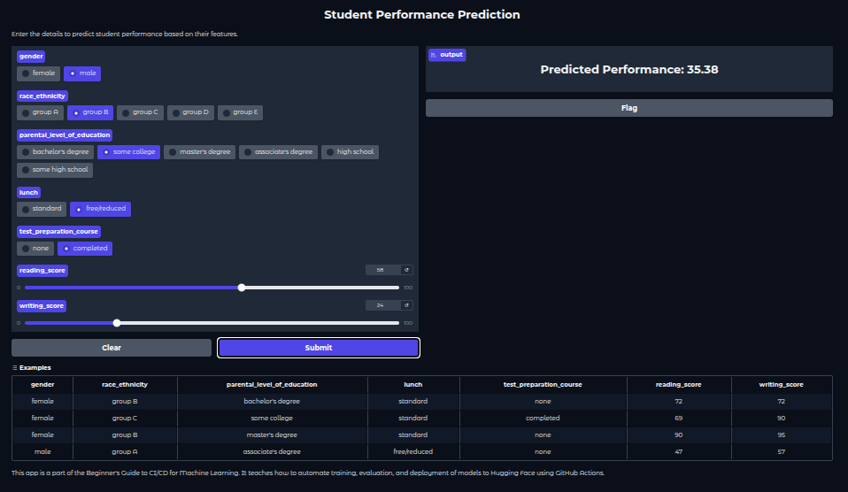

# Machine Learning End-to-End CI/CD Project

Este projeto visa disponibilizar um modelo de machine learning capaz de prever a performance de estudantes a partir de características individuais e contextuais. Ao oferecer essa solução, agrega valor ao permitir que instituições educacionais, professores e gestores possam identificar previamente alunos com risco de baixo desempenho, possibilitando intervenções mais assertivas e personalizadas para melhorar os resultados acadêmicos.

Este repositório tem como objetivo implementar um fluxo completo de CI/CD (Integração Contínua e Entrega Contínua) para modelos de Machine Learning, incluindo testes unitários para funções e treinamentos contínuos a cada nova versão do modelo.


## Objetivos

- Automatizar o ciclo de vida de modelos de Machine Learning.
- Garantir qualidade e confiabilidade com testes unitários.
- Realizar treinamentos automáticos e contínuos a cada push/subida de modelo.
- Facilitar o deploy e monitoramento dos modelos em produção.

## Estrutura do Repositório

```
.
├── data/                # Dados brutos e processados
├── notebooks/           # Notebooks de exploração e prototipagem
├── src/                 # Código fonte dos modelos e pipelines
├── tests/               # Testes unitários e de integração
├── .github/workflows/   # Pipelines de CI/CD (GitHub Actions)
├── requirements.txt     # Dependências do projeto
├── README.md            # Este arquivo
└── ...                  # Outros arquivos relevantes
```

## Como rodar localmente

1. Clone o repositório:
   ```bash
   git clone https://github.com/seu-usuario/Machine_Learning_proj_end_to_end.git
   cd Machine_Learning_proj_end_to_end
   ```

2. Crie um ambiente virtual e install as dependências:
   ```bash
   python -m venv venv
   source venv/bin/activate
   pip install -r requirements.txt
   ```

3. Para rodar a interface Gradio de predições localmente:
   ```bash
   python app/performance_app.py
   ```

4. Execute scripts de treinamento ou notebooks conforme necessário.


## Visual da Interface

Abaixo está um exemplo visual da interface Gradio utilizada para realizar predições com o modelo:



## Rodando os Testes

Os testes unitários estão localizados na pasta `tests/`. Para executá-los:

```bash
pytest tests/
```

Além disso, foram realizados testes de cobertura de código utilizando o pytest-cov para garantir a qualidade e abrangência dos testes:

```bash
pytest --cov=src --cov-report=term-missing --cov-report=html
```

## CI/CD

O projeto faz uso de GitHub Actions para automatizar:

- Execução dos testes unitários a cada push ou pull request.
- Treinamento contínuo do modelo a cada nova versão.
- Deploy automatizado.

Os workflows estão definidos em `.github/workflows/`.

Além disso, os comandos para automação das principais tarefas do ciclo de vida do projeto (como testes, formatação, treinamento e deploy) estão organizados no arquivo `Makefile` na raiz do repositório. Recomenda-se consultar o `Makefile` para execução padronizada dessas etapas.

## Exemplos de Execução do CI/CD

Abaixo estão capturas de tela do GitHub Actions executando as rotinas automatizadas do projeto:


## Contribuição

Contribuições são bem-vindas! Por favor, abra issues ou pull requests.

## Licença

Este projeto está sob a licença MIT.